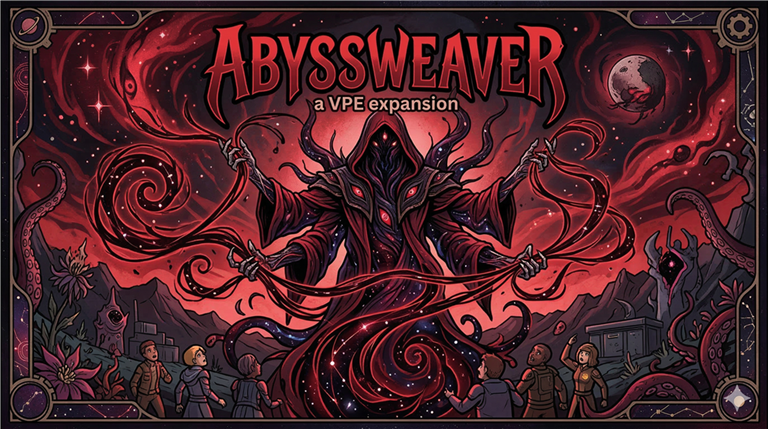

# Abyssweaver: A VPE Expansion

Warning: This mod is intentionally high-power and is recommended for high-difficulty modlists.  
Art credit: All visual assets are from Nano Banana 2.

*A VPE path focused on mutation, corruption, summoning, and anomaly-scale battlefield control.*

Abyssweavers are radical heretics who abandon human reason and biological limits.  
They wire their nervous systems into void whispers and extract forbidden truths through madness and pain.  
To them, physical law is fragile, and living flesh is merely material to tear, stitch, and remold.  
They begin with psychological collapse tactics, then escalate into corpse-thread puppetry and mass flesh fusion, and finally ascend into an inhuman void form.  
Before an Abyssweaver, death is not the end of suffering, but the beginning of the next nightmare.

## Requirements & Load Order

### Required
- Anomaly
- Vanilla Expanded Framework
- Vanilla Psycasts Expanded

### Recommended Load Order
- Harmony
- Vanilla Expanded Framework
- Vanilla Psycasts Expanded
- Abyssweaver

### Performance Note
- High summon density and map-wide effects can be performance-heavy in late-game combat.

## Abilities

### T1
- **Delusion Backflow**  
  Injects void whispers directly into the target mind. On enemies, it forces a severe mental break. On allies, it heavily reduces mood but temporarily suppresses pain and boosts movement and melee dodge.
- **Passive: Distorted Metabolism**  
  Automatically consumes Neural Heat when injured to accelerate regeneration, stop bleeding, and fade scars.
- **Corpse Threads**  
  Reanimates nearby corpses as shamblers for 90 seconds. Evolution node **Flesh Frenzy** unlocks after 100 total revives and significantly buffs all revived shamblers.

### T2
- **Scream of Despair**  
  Large-area psychic shock that massively drops enemy mood and collapses morale.
- **Rend the Veil**  
  Tears open space to summon 5 allied lower-tier anomaly entities for 90 seconds.
- **Passive: Embrace Gloom**  
  Mitigates mood penalties from entities, darkness, and anomaly weather; greatly improves psyfocus sustain during abnormal darkness.

### T3
- **Mind Siphon**  
  Drains skill potential from downed living enemies, transferring power to the caster and devastating target consciousness.
- **Flesh Molding**  
  Consumes fresh corpses and downed enemies within the selected area to create a loyal flesh aberration. More biomass means stronger outcomes.

### T4
- **Engulfing Unlight**  
  Forces map-wide abnormal darkness for half a day. Night entities spawn in large numbers; allies gain void sight support.
- **Global Lobotomy**  
  Map-wide psychic collapse effect (excluding caster), forcing catastrophic mental overload.
- **Passive: Cognitive Hazard**  
  The caster becomes a memetic hazard. Enemies attempting to aim or attack within 55 tiles suffer ongoing consciousness loss and severe mood pressure.

### T5
- **The Nightmare Knocks**  
  Summons 1 higher-tier and 2 lower-tier entities for 90 seconds.
- **Aberrant Reconstruction**  
  Instantly heals conventional injuries and forcibly replaces missing organs/limbs with dark anomalous equivalents.

### T6
- **Domain of Silence**  
  A sustained concentration field. Hostiles in range are subjected to brain withering pressure; firearms, mech turrets, and explosives are suppressed while maintained.
- **Void Ascension**  
  Irreversible transformation. After prolonged collapse, the caster awakens as a Void Avatar.

### T7
- **Abyssal Birth**  
  Sacrifices 7 allied Lords of Legion to summon a permanent apex entity: **Abyssal Atrocity**.
- **Dark Beacon**  
  Opens or closes a void rift. While active, every 2 seconds it spawns 1 higher-tier and 4 lower-tier entities with no hard cap until dismissed.

## New Entities
- **Grafted Aberration**  
  A twisted baseline flesh unit built from mismatched remains.
- **Wailing Flesh-Mound**  
  A massive high-durability, high-regeneration siege creature.
- **Lord of Legion**  
  An advanced flesh war machine forged from heavy biomass input.
- **Abyssal Atrocity**  
  A permanent endgame apex entity with overwhelming battlefield presence.

## Q&A
- **Q: Is this safe for existing saves?**  
  A: Usually yes, but always back up first.
- **Q: Is it compatible with other entity mods?**  
  A: Explicitly adapted for Ratkin Anomaly+ and Rustspark Crisis. Other entity-heavy mods may work but can produce summon AI edge cases.
- **Q: CE compatibility?**  
  A: Not specifically tested; likely coexistence.
- **Q: Can I remove it mid-save?**  
  A: Not recommended. Purge mod-added entities first if removal is unavoidable.
